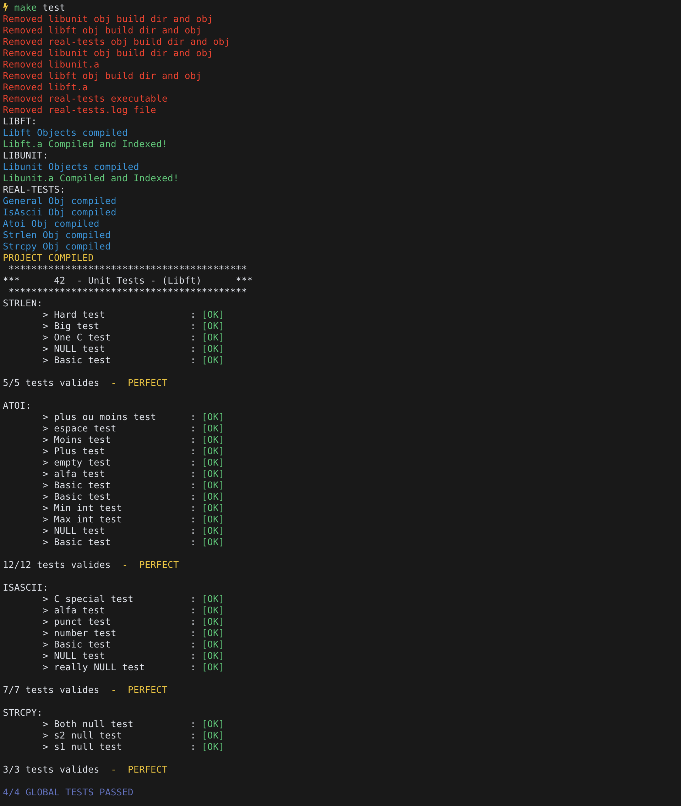

# 42-LibUnit

This project required to work in a duo. We were asked to build a simplified version of a battery of UnitTests.

We were required to use it to test one of our previous projects. We chose my [libft](https://github.com/abguimba/42-libft).




Just a simple

```
$/> make test
```

inside of a folder with some functions/executable to check inside of the realtests/ folder will compile the whole framework and start the testing for you.
I included my own test files from my libft.


[Norminette subject](https://github.com/Binary-Hackers/42_Subjects/blob/master/04_Norme/norme_2_0_1.pdf)

[Every 42 subject](https://github.com/agavrel/42_Subjects)
